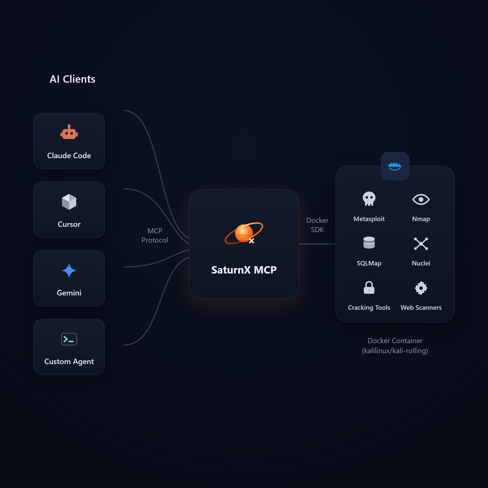

<p align="center">
  
</p>

<h1 align="center">Hercules MCP</h1>

<p align="center">
  <em>Containerized offensive-security workflows for AI agents through the Model Context Protocol</em>
</p>

<p align="center">
  
  
  
  
</p>

Hercules MCP is a Python FastMCP server that gives terminal-capable AI agents a
structured interface to security tools running in an owned Kali Docker
container. It keeps evidence in managed host workspaces and returns bounded,
agent-friendly results without hiding whether output was filtered, truncated,
or interrupted.

> **Authorized use only.** Run Hercules only against systems for which you have
> explicit permission. Installation and verification are local and
> non-destructive; they must not scan, exploit, navigate to, or check public
> egress against an external target.

<p align="center">
  
</p>

## Contents

- [Install with your AI agent](#install-with-your-ai-agent)
- [Capabilities and MCP surface](#capabilities-and-mcp-surface)
- [How Hercules works](#how-hercules-works)
- [Headless browser automation](#headless-browser-automation)
- [Output, artifacts, sessions, and workspaces](#output-artifacts-sessions-and-workspaces)
- [MCP resources and agent guidance](#mcp-resources-and-agent-guidance)
- [Setup facts and client configuration](#setup-facts-and-client-configuration)
- [Troubleshooting](#troubleshooting)
- [Development](#development)
- [Security model](#security-model)
- [Acknowledgements](#acknowledgements)
- [License](#license)

## Install with your AI agent

Paste this prompt unchanged into any terminal-capable coding agent. The same
prompt adapts to Windows, macOS, and capable Linux distributions:

```text
Install or upgrade Hercules MCP from https://github.com/0xMihirK/hercules-mcp by following all ordered checkpoints in https://github.com/0xMihirK/hercules-mcp/blob/main/install.md, including its mandatory final cleanup. Adapt to my actual operating system, CPU architecture, shell, Docker context, trust policy, and active terminal-capable AI client; do not assume a package manager, init system, inherited PATH, or client schema. On a first install, ask what I intend to use Hercules for, recommend the smallest useful capability set, explain important omissions, confirm user-wide or project-local scope, and ask about a browser proxy only if browser capability is selected. Prepare a durable non-synced checkout and locked editable absolute launcher before reading Hercules' non-mutating setup facts; capture that JSON as UTF-8 stdout separately from stderr, then build and validate the exact reported stable Kali image without silently dropping capabilities or blindly retrying deterministic failures. Preserve my confirmed choices, `.env`, secrets, workspace evidence, verified assets, and unrelated client settings. Configure only my active client, validate its effective schema, render its Hercules STDIO entry with the absolute launcher and no secrets, and install the independent portable skill only when that client supports Agent Skills; for OpenCode use its current local-command shape and a 120000 millisecond MCP timeout. Prove a cold MCP connection, tool/resource listing, successful local Docker-backed call, local-only browser check when selected, and clean shutdown instead of accepting process exit or structured tool errors as success. In a success-or-failure cleanup path, remove only transaction-owned temporary files, processes, verification containers, released port bindings, staging data, and obsolete client backups, while preserving committed state, evidence, valid caches, and unrelated configuration. Never print secrets, contact an external target during setup, install a bare-PATH adapter, configure unrelated clients, broadly prune Docker or temporary storage, or silently perform privileged system changes; clearly report any prerequisite, unsupported client, source defect, cleanup failure, or manual action that requires me, and never report success before cleanup passes.
```

The authoritative installation contract is [install.md](install.md). It defines
required outcomes and safety boundaries without assuming a package manager,
shell, init system, CPU architecture, Docker context, or client configuration
format. The active agent inspects the real environment, uses its native tooling
knowledge, and consults current vendor documentation before acting.

On a first install, the agent:

- asks what Hercules will be used for and recommends the smallest useful
  capability set;
- confirms user-wide or project-local scope;
- asks about a browser proxy only when browser support is selected;
- prepares a durable, non-synced checkout and locked Python tool environment;
- resolves its absolute launcher and reads the matching setup facts;
- builds and validates the selected stable-snapshot image before committing state;
- installs the provider-neutral portable skill independently from an MCP-only
  native plugin adapter; and
- registers one secret-free absolute STDIO launcher in the active client.

Upgrades preserve the selected capabilities, `.env`, secrets, workspace
evidence, verified assets, scope, proxy preference, and unrelated client
settings unless the operator explicitly changes them. Hercules does not provide
a mutating setup executable: the installing agent owns the transaction and uses
Hercules' read-only setup facts to avoid guessing.

Host prerequisites are Git, [`uv`](https://docs.astral.sh/uv/), and a working
Docker Engine, Docker Desktop, or compatible Docker context with local STDIO
MCP support in the active client. Missing privileged
prerequisites require the operator's involvement; setup must not silently alter
system packages, services, groups, or daemon configuration. Docker-specific
agents can consult [Docker's complete LLM context](https://docs.docker.com/llms-full.txt).

## Capabilities and MCP surface

The confirmed capability set controls both the binaries placed in the Kali
image and the MCP schemas registered with the client. Core shell, session, and
workspace services are mandatory.

| Profile | Registered tools | Resources |
| --- | ---: | ---: |
| Full, including Metasploit | 45 | 7 |
| Full, with `SKIP_METASPLOIT=true` | 40 | 7 |
| Custom selection | Fewer, according to selected and hidden tools | 7 |

The catalog groups these stable capability keys:

| Area | Capability keys | Functionality |
| --- | --- | --- |
| Core | `shell`, `session`, `workspace` | Commands, jobs, lifecycle, network information, and binary-safe files |
| Reconnaissance | `dns`, `whois`, `amass` | DNS/WHOIS queries and subdomain or ASN enumeration |
| Network | `nmap`, `curl`, `ncat`, `hping3` | Port/service/NSE scanning, HTTP, sockets, listeners, and packet crafting |
| Web | `whatweb`, `fuzz`, `webvuln`, `nuclei`, `sqlmap` | Fingerprinting, discovery, vulnerability checks, templates, and SQL injection workflows |
| Exploitation | `searchsploit`, `metasploit` | Exploit-DB, modules, sessions, listeners, and payloads |
| Passwords | `hydra`, `john` | Authorized online testing and offline hash cracking |
| Forensics/CTF | `binwalk`, `steghide` | Carving, metadata, and steganography |
| Browser | `browser` | All ten structured browser tools, screenshots, sessions, and loopback streaming |

Bundles keep consolidated APIs intact: Nmap includes NSE authoring, Nuclei
includes template authoring, and browser includes every `browser_*` tool.
SecLists and rockyou are required only by profiles that use them.
`HERCULES_DISABLED_TOOLS` can independently hide an installed tool, but it
cannot add a binary omitted from the image.

## How Hercules works

1. The MCP client starts the absolute `hercules` STDIO launcher.
2. Hercules exposes tool and resource schemas immediately while one shared,
   shielded Docker bootstrap task continues in the background.
3. Docker-backed calls wait for core readiness; Metasploit can continue
   initializing independently after ordinary tools become usable.
4. A typed MCP call is validated and routed to a generation-bound service.
5. The command runs inside the owned, capability-specific Kali container.
6. Results are parsed and bounded while complete evidence is retained in the
   workspace when necessary.

If core initialization is still running after a bounded tool wait, Hercules
returns `runtime_initializing` without closing MCP. A deterministic startup
failure returns `runtime_unavailable` while host-side schemas and resources
remain accessible. On restart, Hercules reclaims only containers proven stale
by its checkout-lock token, project identity, and workspace identity; unrelated
or live instances are preserved.

Each session has an eight-character hexadecimal ID and an owned manifest.
Container replacement resets browser daemons, Metasploit clients, channels,
jobs, and other generation-bound state while preserving host evidence. An
operator-requested stop stays terminal until an explicit new session.

Target policies apply to structured DNS, WHOIS, HTTP, scanners, redirects,
browser navigation, and Metasploit routes. Scoped hostnames are normalized and
resolved, every address is checked, and deny rules win. The default is
permissive until `ALLOWED_TARGETS` or `BLOCKED_TARGETS` is configured.

## Headless browser automation

The optional browser image combines
[agent-browser](https://github.com/vercel-labs/agent-browser) with
[CloakBrowser](https://github.com/CloakHQ/cloakbrowser). CloakBrowser source is
not bundled in this repository and is not needed on the host for normal
Hercules use. The supported image installs the official PyPI
[`cloakbrowser`](https://pypi.org/project/cloakbrowser/) wheel at exact version
`0.5.3`, verifies its SHA-256, and installs its managed Chromium binary.

If that exact artifact is unavailable or incompatible, the installing agent
checks the official repository and PyPI, selects the latest stable compatible
release, and records an exact version and official artifact checksum before
building. It must not use an unpinned Git branch or silently substitute another
browser while claiming CloakBrowser behavior.

- Sessions always run headlessly; screenshots and loopback live streaming
  remain available.
- `browser_screenshot` validates PNG bytes and returns native MCP
  `ImageContent`, with optional annotations and compatibility base64 metadata.
- Proxy precedence is `browser_open(proxy=...)`, then `BROWSER_PROXY_URL`, then
  direct host egress. HTTP, HTTPS, SOCKS5, and SOCKS5H proxies are supported,
  and credentials are redacted from responses and logs.
- When a proxy is active, non-proxied WebRTC UDP is blocked by default.
- Changes to proxy, locale, or timezone relaunch that session transactionally.

Docker does not provide residential or ISP egress; direct container traffic
normally shares the host's public IP. CloakBrowser reduces common automation
signals, but Hercules cannot guarantee CAPTCHA or bot-detection avoidance.

Use structured browser tools first. `browser_cmd` is an administrator escape
hatch for supported advanced controller operations and sits outside structured
target guarantees. Load `browser_skill` before using it.

## Output, artifacts, sessions, and workspaces

Hercules optimizes output for agents without treating discarded text as
evidence:

- terminal controls and exact known banners are removed conservatively;
- scanner-specific compaction affects only characterized stdout noise;
- stderr warnings, errors, tracebacks, and completeness diagnostics remain;
- streams and combined responses have bounded inline budgets;
- timeouts report truthful termination and partial-output state; and
- structured Nmap, Nuclei, ffuf, httpx, and browser results replace duplicated
  raw text when parsing succeeds.

`output_complete` describes inline output. `evidence_complete` says whether
complete raw evidence remains inline or in a verified artifact. Large workspace
reads support `offset` and `max_bytes` paging.

Workspace paths reject traversal, alternate drives, device paths, and symlink
or reparse-point escapes. Evidence retention is disabled by default; non-empty
evidence is never silently deleted. `hercules-workspace` exposes list, pin,
unpin, prune, and migrate operations. Pruning is report-only without `--apply`
and protects active, pinned, unowned, and running-job sessions. Migration stages
and verifies the copy, retaining the source unless deletion is explicit.

## MCP resources and agent guidance

The canonical [`hercules-mcp` skill](skills/hercules-mcp/SKILL.md) is installed
independently of native plugins. Plugin manifests contain MCP adapter metadata
only; they do not embed, copy, or declare a skill. Progressive references teach
tool selection, parameters, bounded parallelism, output interpretation,
artifacts, and recovery without bloating the always-on MCP context.

Hercules exposes seven resources:

| Resource | Use it when |
| --- | --- |
| `resource://agent_skills/nse` | Installed NSE scripts cannot express an authorized protocol/check; read it before custom Lua authoring |
| `resource://agent_skills/nuclei` | Installed Nuclei templates/tags cannot express the required detection; read it before custom YAML authoring |
| `resource://post_exploitation/linpeas` | An authorized Linux shell needs broad local enumeration; this is an embedded lite variant |
| `resource://post_exploitation/winpeas` | An authorized Windows command shell needs broad local enumeration |
| `resource://post_exploitation/powerup` | An authorized PowerShell shell needs service or registry follow-up |
| `resource://post_exploitation/gtfobins` | Linux evidence identifies an exact sudo, SUID, or capability-enabled binary |
| `resource://post_exploitation/lolbas` | Windows evidence identifies an exact signed binary, script, library, or component |

Prefer installed NSE scripts and Nuclei templates before authoring custom
content. Do not load large post-exploitation resources speculatively.
Enumeration findings are evidence to verify, not permission to exploit.

## Setup facts and client configuration

`hercules --setup-info-json` is a strictly read-only information surface for
installation agents. Optional selectors let an agent normalize a capability
profile, inspect an existing non-secret state file, describe an approved custom
CA bundle, or describe an exactly pinned replacement CloakBrowser wheel. Its
JSON reports:

- catalog, normalized selection, required binaries, wordlists, and MCP counts;
- source revision, Python lock identity, and absolute-launcher requirements;
- stable Kali base, APT suite, platform, image tag, labels, and build inputs;
- capability-manifest checksum and runtime evidence paths;
- CloakBrowser version, official artifact URL, SHA-256, and readiness checks;
- optional certificate-only BuildKit secret metadata and fingerprint;
- non-secret environment requirements and schema-4 state locations; and
- local acceptance assertions.

The mode does not build, download, install, write, modify `PATH`, register a
client, or update Docker. The active agent chooses suitable host-native actions
from these facts and [install.md](install.md).

Repository MCP files are templates and must be rendered before installation;
their bare `hercules` command is never a finished registration. An effective
MCP entry needs an absolute launcher and no secrets. Its exact JSON,
JSONC, TOML, or CLI representation depends on the installed client:

```json
{
  "mcpServers": {
    "hercules": {
      "command": "<absolute path to the managed hercules launcher>",
      "args": []
    }
  }
}
```

The agent must preserve unrelated configuration and validate the client's
effective entry, and it configures only the active client. For OpenCode it also
honors `OPENCODE_CONFIG` and XDG paths,
preserves JSONC comments, supports the installed client's direct or nested MCP
layout, uses its current local-command form with an absolute command array and
`timeout: 120000`, and places the independent skill at
`.agents/skills/hercules-mcp`.

Runtime values remain in the protected `.env`. See
[the complete template](.env.example). The most operational settings are:

| Variable | Purpose |
| --- | --- |
| `HERCULES_INSTALLED_CAPABILITIES` | Agent-maintained capability selection |
| `HERCULES_DISABLED_TOOLS` | Independently hide an installed MCP tool |
| `ALLOWED_TARGETS` / `BLOCKED_TARGETS` | Structured target policy; deny rules win |
| `HERCULES_WORKSPACE_ROOT` | Override the managed evidence root |
| `HERCULES_WORDLIST_ROOT` | Reusable verified wordlist and extraction cache |
| `HERCULES_BUILD_CA_SHA256` | Fingerprint of optional certificate-only build trust |
| `HERCULES_IMAGE_PLATFORM` | Exact `linux/amd64` or `linux/arm64` runtime platform |
| `HERCULES_CLOAKBROWSER_WHEEL_URL` | Exact PyPI artifact URL for a preserved browser pin |
| `HERCULES_LISTENER_PORTS` | Explicit reverse-listener ports exposed by bridge networking |
| `BROWSER_PROXY_URL` | Default browser proxy kept outside client configuration |
| `BROWSER_STREAM_PORT` | Optional loopback-only browser stream port |
| `SKIP_METASPLOIT` | Omit the five Metasploit tools from an installed full profile |

## Troubleshooting

Ask the active agent to compare current state with the read-only setup facts and
image capability manifest before deleting or rebuilding anything. It should
distinguish missing Git, `uv`, or Docker; a stopped or incompatible daemon; TLS
trust failure; image-label mismatch; missing backend or asset; CloakBrowser or
managed-Chromium failure; MCP startup failure; and client-registration failure.
An unchanged Docker layer failing again is a deterministic source defect, not a
reason for another blind retry or for silently removing the selected capability.

The pinned public CA bootstrap remains present before Kali's first HTTPS APT
operation. In an authorized TLS-interception environment, the agent can pass a
bounded certificate-only PEM as a BuildKit secret and record only its SHA-256.
Certificate/hostname verification must never be disabled, and certificate
contents must not enter the checkout or state.

Failed work must restore the last committed Hercules client entry and
non-secret state. Checksum-valid downloads and immutable Docker cache may be
reused. Existing workspaces, evidence, secrets, successful images, and unrelated
client configuration must remain untouched.

## Development

Key areas are:

```text
hercules/
|-- main.py                  # FastMCP entrypoint and read-only setup mode
|-- core/                    # Configuration, setup facts, workspaces, lifecycle, execution, jobs
|-- output/                  # Rendering, filters, redaction, and truncation
|-- tools/                   # Structured MCP tools, including browser operations
`-- resources/               # MCP resources and embedded lite scripts
skills/hercules-mcp/         # Canonical provider-neutral portable skill
docker/entrypoint.sh         # Container readiness and loopback-only services
Dockerfile                   # Deterministic capability-specific Kali image
install.md                   # Agent-directed installation contract
```

Before submitting changes, compile the package, run the local unit suite when
available, validate setup facts and package contents, and check the Git diff for
whitespace errors. Tests, vulnerable fixtures, acceptance evidence, `.env`,
workspaces, wordlists, and distributions are local-only. `tests/` remains
ignored and untracked, and neither the wheel nor source distribution contains
it.

## Security model

- The Kali container runs powerful root-level security tooling. Docker is a
  containment boundary, not a substitute for authorization or host hardening.
- Metasploit RPC and browser-stream ports bind to host loopback. Explicitly
  configured reverse-listener ports remain externally reachable.
- Secrets, cookies, tokens, form values, and proxy credentials are redacted
  from display metadata while invoked processes still receive original values.
- `shell_exec`, `browser_cmd`, and documented raw `extra_args` fields are
  trusted administrator escape hatches outside structured target guarantees.
- Empty target policy is permissive for backward compatibility; configure
  allow/deny scopes before use in controlled environments.
- `pymetasploit3` remains pinned despite
  [GHSA-qpc3-8vqg-8g6w](https://osv.dev/vulnerability/GHSA-qpc3-8vqg-8g6w)
  because no fixed release exists. Hercules does not call the affected API and
  rejects CR/LF in Metasploit option keys and values.

## Acknowledgements

Hercules builds on
[Kali Linux](https://www.kali.org/),
[FastMCP](https://github.com/jlowin/fastmcp),
[Metasploit Framework](https://www.metasploit.com/),
[ProjectDiscovery](https://projectdiscovery.io/),
[SecLists](https://github.com/danielmiessler/SecLists),
[agent-browser](https://github.com/vercel-labs/agent-browser), and
[CloakBrowser](https://github.com/CloakHQ/cloakbrowser). Thank you to their
maintainers and contributors.

## License

Hercules MCP is distributed under the [MIT License](LICENSE).
